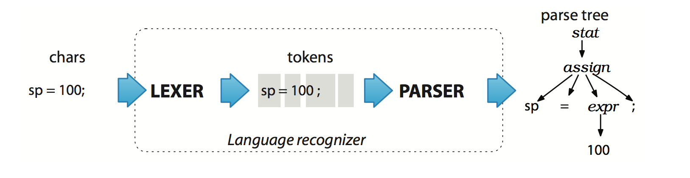

# 2.1 从 ANTLR 元语言开始

* language 是 valid sentences 的集合
  + sentence 由 phrase（词组）组成
    - phrase 由 subphrase 和 vocabulary symbol（词汇符号）组成。

因此要实现一门语言，需要有一个程序，它可以读取 sentences，并正确处理其解析到的 phrase 和 symbol，这样的程序可分为两类：

1. Interpreter: the application that **computes** or **executes** sentences
  * 计算器
  * 配置文件读取器
  * Python 解释器
2. Translator: **converting** sentences from one language to another
  * Java to C# 转换器
  * C 编译器

要达到各自目的，interpreter 和 translator 必须能 **识别** 出特定语言所有的 valid sentence, phrase 和 subphrase。

识别一个 phrase 是指可以将它从众多 component 中辨识出，并能将它与其他 phrase 区分出来。例如将 `sp = 100;` 识别到意味着：

1. 我们知道 `sp` 是赋值对象，而 `100` 是要赋的值（与识别主语、谓语、宾语类似）；
2. language appliation 能将它与其他语句（例如 `import`）**区分** 开；

识别语言的程序被称为 parser（语法分析器）或 syntax analyzer（句法分析器）：

* syntax（句法）是指约束语言各组成部分关系的 **规则**，本书用 ANTLR grammar 来指定语言的句法；
* grammar（语法）只是 **规则** 的集合
  + 每条规则表达一个 phrase 的结构（那岂不是 grammar 就是 syntax 的集合？）
  + ANTLR grammar 遵循 ANLTR meta-language 语法

ANTLR 会将 grammar 转换为 parser，与专家手写的 parser 不相上下。

## 词法分析 -> 语法分析

我们读一个 sentence 时不会一个 char 一个 char 地读，而是将 sentence 视为 word 组成的流，整个阅读理解分为两步：

1. 通过潜意识将 char 序列聚合为 word，并在大脑查找每个 word 的意义；
2. 之后识别整个 sentence 的 grammatical structure；

languange application **parseing** sentences 的过程与之类似，可以分为两个相似，但独立的阶段：

1. lexical analysis（词法分析）or tokenizing（词法符号化）
  * 将 chars 聚集为 word/symbol/token
  * 执行词法分析的应用为 lexer（词法分析器）
    + 因为语法分析器并 **不关心** 具体 token，而只关心 token type，因此 lexer 将相关 tokens 按 token class(token type) 分类
    + token 包含两个信息：
      - the token type（确定词法结构）
      - the text matched for that token by lexer
2. actual parsing
  * 输入 tokens，输出 sentence structure
  * ANTLR 生成的 parser 会构建 parse tree（语法分析树）

下图是语言识别器中的基本数据流动：

* chars -> token -> parse tree

## parse tree

parse tree 各结点：

* 内部结点为 phrase name
* 根结点为最抽象的 phrase name（本例中为 `stat`）
* 叶子结点为输入的 token

parse tree 可被应用灵活处理，例如可以多次遍历 parse tree，而非多次 parsing，以提升效率（parse tree 包含了所有解析的过程信息）。

要使用、调试 ANTLR 语法，必须理解 ANTLR 是如何将 **语法规则** 转换成 **人类可读的代码** 的，因此下节介绍 parsing 的工作原理。
