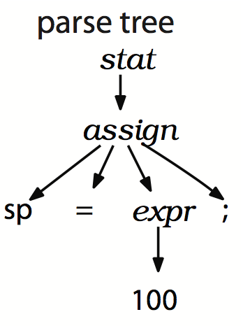

# 2.2 实现一个语法分析器

## recursive-descent parser

ANTLR 根据 grammar rule 生成 recursive-descent parser：

* recursive-descent parser 仅仅是一些 recursive method 的集合；
* 每一条 rule 对应一个 recursive method；

首先被调用的 rule 会变成 parse tree 的根结点，descent 是指解析从 parse tree 的根节点开始，一路向下，直到叶子结点，这种解析方式为 top-down parsing，而 recursive-descnet parser 仅仅是其中一种而已。

下面是 ANTLR 为 `assign` 规则（`assign : ID '=' expr ';'`）生成的 recursive method：

```Java
/**
 * assign 方法是根据 assign 规则生成的
 */
void assign() {
  match(ID);  // compare ID to current input symbol then consume
  match('=');
  expr();     // match an expression by calling expr()
  match(';');
}
```

* `assign()` 仅仅验证所需的 token 全部存在，且顺序正确；

`assign` 规则生成的 parse tree 如下：



recursive-descent parser 的神奇之处在于：

* 依次调用 `stat()` `assign()` 和 `expr()` 形成的 **路线** 对应 parse tree 的中间结点；
* 调用 `match()` 对应 parse tree 的叶子结点；

## alternatives

assign 规则只有一个 alternative，而下面的 stat 规则有多个 alternatives：

```Java
stat: assign
    | ifstat
    | whilestat
    ...
```

stat 规则生成的函数类似 `switch` 语句：

```Java
void stat() {
  switch (<<current input token>>) {
    case ID    :  assign(); break;
    case IF    :  ifstat(); break;
    case WHILE : whilestat(); break;
    ...
    default: ...
  }
}
```

## parsing decision

`stat()` 方法必须通过检查 **the next input token** 来做 parsing decision/prediction，parsing decision 决定使用哪个 alternative。

例如 `stat()` 中，看到 `WHILE` 关键字就选 stat 规则第 3 个 alternative，从而执行 `whilestat()` 方法。

>lookahead token
>
>lookahead token 即 next input token，是指 parser 在实际 match 和 comsume 之前 sniff（嗅探）到的 **任意 token**。

有时 parser 需要 **很多** lookahead token 才能决定选用哪个 alternative，最夸张的情况下，甚至需要考虑从当前位置直到文件结束的所有 token！

幸运的是，ANTLR 会自动选择 **足够数量** 的 lookahead token，以做出正确的 parsing decision。
