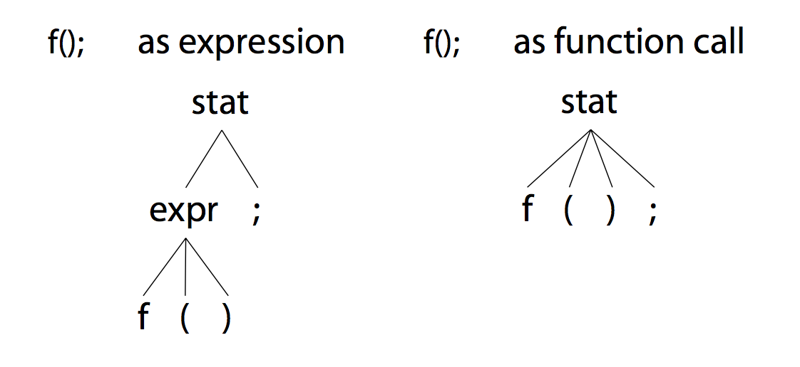

# 2.3 你再也不能往核反应堆多加水了

phrase 或 sentence 都可能匹配多个 grammatical structure，此时称它们有歧义。

#### 最明显的歧义

```Java
stat: ID '=' expr ';'
    | ID '=' expr ';'
    ;
```
* 重复的 alternative

#### 更隐晦的歧义

```Java
stat: expr ';'         // expression statement
    | ID  '(' ')' ';'  // function call statement
    ;
expr: ID '(' ')' ';'
    | INT
    ;
```

stat 规则有两个 alternative，第一个是表达式规则，第二个是函数调用规则，而文本 `f();` 既可以匹配表达式，又可以匹配函数调用，有两种不同解释：



* 左侧 parse tree 是 `f();` 匹配第一个 alternative 的场景；
* 右侧 parse tree 是 `f();` 匹配第二个 alternative 的场景；

若存在歧义，ANTLR 会选择 **第一个 alternative**，上面的例子中，parser 会将 `f();` 匹配为表达式。

#### lexer 中的歧义

歧义不仅会发生在 parser 中，也会发生在 lexer 中，ANTLR 通过选择 gammar 中 **最靠前** 的 lexer rule 来解决 lexer 歧义。

编程语言中的 keyword rule 和 identifier rule 通常会存在歧义，例如：

```Java
BEGIN : 'begin' ;
ID    : [a-z]+ ;
```

文本 `begin` 既可以匹配 `BEGIN` 又可以匹配 `ID`，因此存在歧义。

但文本 `beginner` 却只会匹配 `ID`，而不会匹配成 `BEGIN` 后面跟着 `ID`，因为 lexer 会为每个 token 匹配 **longest** string possible。

#### 无法避免的歧义

部分语法天生存在歧义，无法修正，例如表达式 `1 + 2 * 3`，既可以从左到右计算（Smalltalk），又可以按优先级计算。

#### 通过 context 信息解决歧义

部分歧义可用 context information 解决，例如 `i * j`，若 `i` 是变量，则其为表达式；若 `i` 为类型，则其为指针声明。
