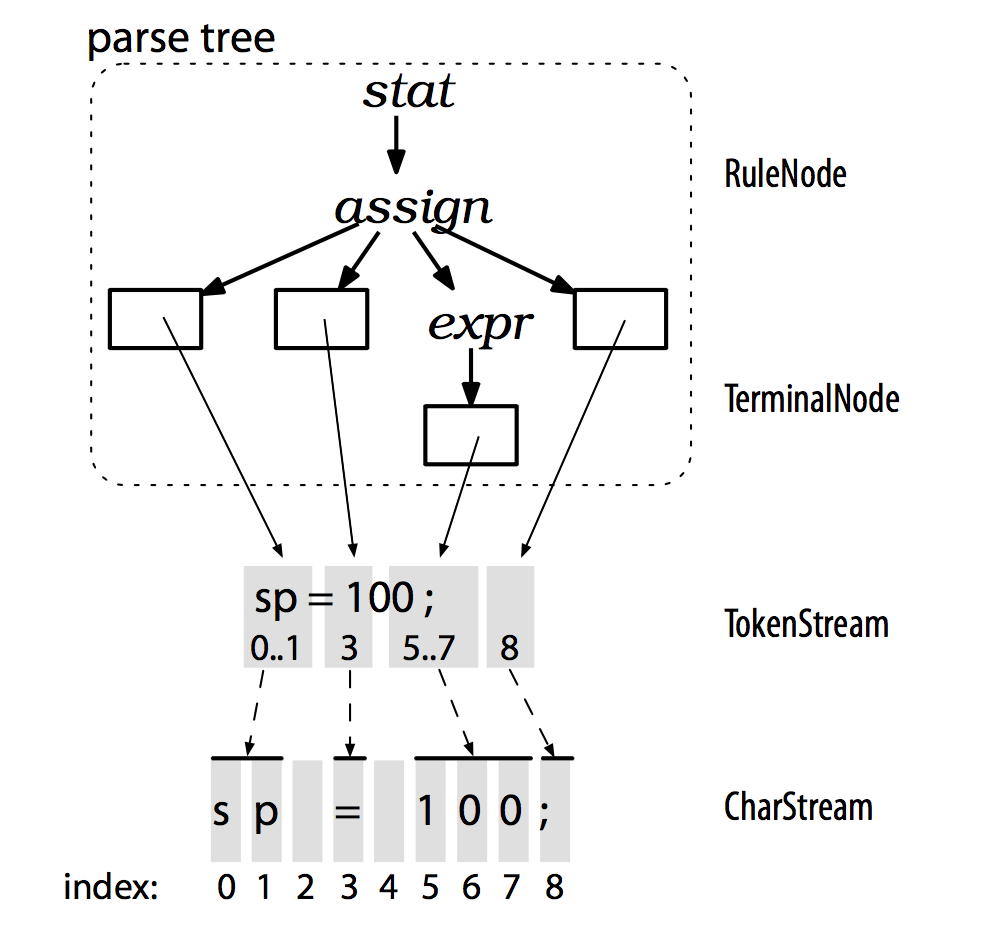
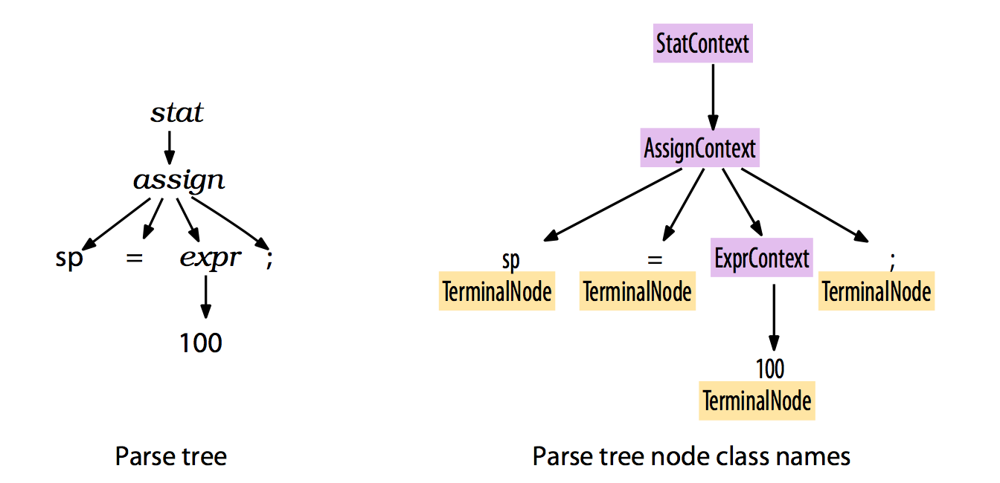

# 2.4 使用语法分析树来构建语言类应用程序

要创建 language application，必须能够对 input phrase/subphrase 做合适的代码处理，最简单的方式是操作 parser 生成的 parse tree。

前面讲过：

* lexer 处理输入的 character 流，解析 token，并将 token 传递给 parser
* parser 根据 token 检查 sentence syntax 是否合法，并生成 parse tree

下面是 ANTLR 在识别语言、生成 parse tree 过程中涉及的数据结构

* 连接 lexer 和 parser 的是 `TokenStream`
* `RuleNode` 和 `TerminalNode` 是 `ParseTree` 的子类

为 **节省内存**，ANTLR 数据结构会尽量共享内存：

* parse tree 叶子结点（`TernimalNode`）是 token 容器，仅持有指向 `TokenStream` 中对应 token 的“指针”；
* `TokenStream` 中的 token 仅保存该 token 在 `CharStream` 中的起始字符索引；

`ParseTree` 的子类 `RuleNode` 和 `TerminalNode` 分别是子树的根节点、叶子节点，ANTLR 会为 **每条规则** 生成一个 `RuleNode` 的子类（为更方便访问该树的元素）：

* `StatContext` `AssignContext` 和 `ExprContext` 是 `RuleNode` 的子类
* 根节点叫 `XXXContext`，because they record everything we know about **the recognition of a phrase by a rule**. 
* 每个 context 对象记录它识别到的 phrase 的起始 token，并能访问该 phrase 的所有元素
  + `AssignContext` 提供 `ID()` 和 `expr()` 方法，用于访问 assign 语法识别到的 phrase 包含的元素

现在可以实现对 parse tree 的深度优先遍历了，遍历过程中可以对节点做各种操作，也可以用 ANTLR 自动生成的遍历机制，以避免重复手写。
