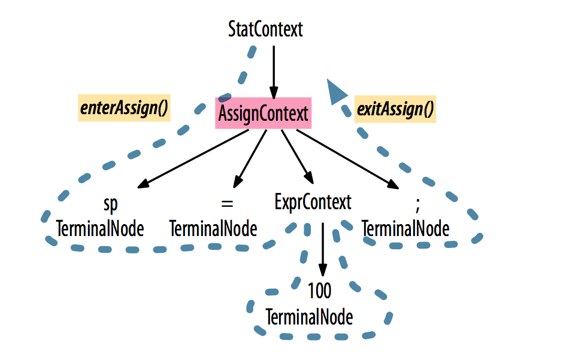
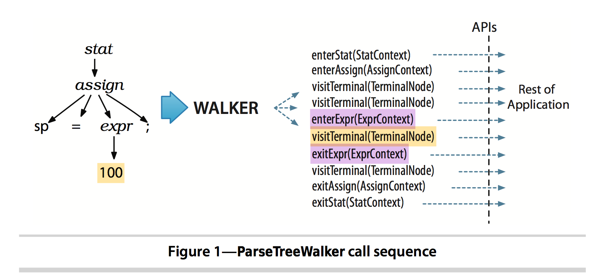

# 2.5 Parse-Tree Listeners and Visitors

ANTLR 运行时支持 2 种 parse tree 遍历方式：

* 默认 built-in tree walker
  + 自动生成 parse-tree listener 接口，响应 walker 触发的事件
* 使用 visitor 设计模式的 tree walker

## Parse-Tree Listeners

* `ParseTreeWalker`
* `ParseTreeListener`

ANTLR 为 **each grammar** 生成 `ParseTreeListener` 子类，对 grammar 中的每条规则，生成对应的 `enter` 和 `exit` 方法：

* ANTLR 为 assign 规则生成 `enterAssign()` 和 `exitAssign()` 方法
* `AssignContext` 对象作为参数传递给 `enterAssign()` 和 `exitAssign()` 方法

在上面的深度优先遍历中，`ParseTreeWalker` 对监听器方法的完整调用如下：

* 根节点：`enterXXX` 和 `exitXXX`
* 叶子结点：`visitTerminal`

lister 方式优点：

* 无需手动编写 **遍历** 代码；
* 全自动