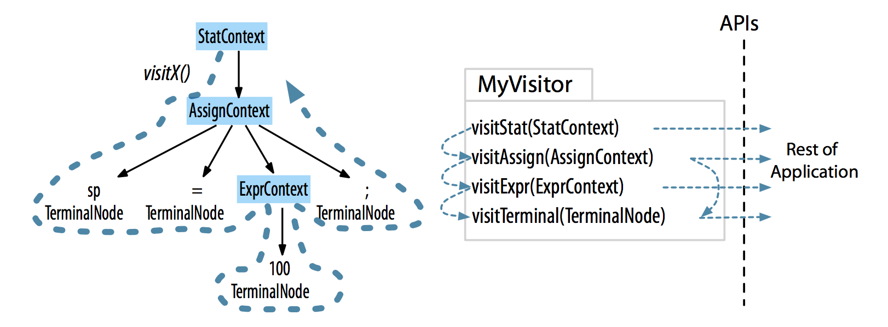

# 2.5 Parse-Tree Listeners and Visitors

ANTLR 运行时支持 2 种 parse tree 遍历方式：

* 默认 built-in tree walker
  + 自动生成 parse-tree listener 接口，响应 walker 触发的事件
* 使用 visitor 设计模式的 tree walker

## Parse-Tree Listeners

* `ParseTreeWalker`
* `ParseTreeListener`

ANTLR 为 **each grammar** 生成 `ParseTreeListener` 子类，对 grammar 中的每条规则，生成对应的 `enter` 和 `exit` 方法：


* ANTLR 为 assign 规则生成 `enterAssign()` 和 `exitAssign()` 方法
* `AssignContext` 对象作为参数传递给 `enterAssign()` 和 `exitAssign()` 方法

在上面的深度优先遍历中，`ParseTreeWalker` 对监听器方法的完整调用如下：


* 根节点：`enterXXX` 和 `exitXXX`
* 叶子结点：`visitTerminal`

listener 方式优点：

* 无需手动编写 **遍历** 代码；
* 全自动

## Parse-Tree Visitors

有时需要控制 **遍历本身**，通过 **函数调用** 来访问子节点（listener 是通过 **回调函数**），此时可以通过 `-visitor` 生成 visitor 接口：

* 每个 grammar 对应一个 visitor interface
* **一条规则** 对应 visitor interface 中的一个 `visit` 方法

下面是 assign 语法生成的 visitor 访问模式：



* 深度优先
* 当遇到根节点时，ANTLR 会调用 `visitStat` 函数

visitor 接口使用如下：

```Java
ParseTree tree = ...;  // parse tree is the result of parsing
MyVisitor v = new MyVisitor();
v.visit(tree);
```

* 必须手动调用 `visit` 函数

## 术语

* Language
  + A language is a set of **valid sentences**
  + Sentences are composed of **phrases**, which are composed of subphrases, and so on
* Grammar
  + A grammar formally defines the **syntax rules** of a language
  + Each rule in a grammar expresses the **structure** of a subphrase
* Syntax tree/parse tree
  + This represents the structure of the sentence where each subtree root gives an abstract name to the elements beneath it.
  + The **subtree roots** correspond to **grammar rule** names.
  + The **leaves** of the tree are symbols or **tokens**s of the sentence.
* Token
  + A token is a **vocabulary symbol** in a language;
  + these can represent a category of symbols such as "identifier" or can represent s single operator or keyword.
* Lexer or tokenizer
  + This breaks up an **input character stream** into **tokens**;
  + A lexer performs lexical analysis.
* Parser
  + A parser checks sentences for membership in a specific language by checking the sentence's structure against the rules of a grammar.
  + ANTLR generates top-down parsers called **ALL(*)** that can **use all remaining input symbols to make decisions**.
  + Top-down parser are **goal-oriented** and start matching at the rule associated with the coarsest, such as *program* or *inputFile*.
* Recursive-descent parser
  + This is a specific kind of top-down parser implemented with **a function** for **each rule** in the grammar.
* Lookahead
  + Parsers use lookahead to **make decisions** by comparing the symbols that begin each alternatives.
