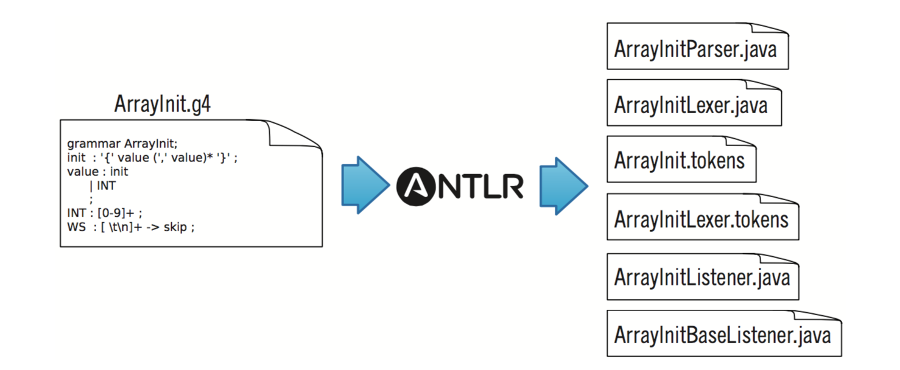

# 3.1 The ANTLR Tool, Runtime, and Generated Code

ANTLR 官网提供的 jar 由两部分组成：

* ANTLR tool `org.antlr.v4.Tool`
  + 说 run ANTLR on a grammar 时，指的是 ANTLR tool，
* ANTLR runtime API
  + 运行 ANTLR 生成的 lexer parser 时，需要 ANTLR runtime 的支持
  
因此使用 ANTLR 分为 3 步：

1. run **ANTLR tool** on a grammar
2. then compile the generated lexer and parser against **ANTLR runtime**
3. finally, run lexer/parser with **ANTLR runtime**

实现 language application 首先要写出它的语法：

```Java
// ArrayInit.g4
/** 
 * 1. Grammars always start with a grammar header. 
 * 2. This grammar is called ArrayInit and must match the filename: ArrayInit.g4
 */
grammar ArrayInit;

/** A rule called init that matches comma-separated values between {...}. */
init : '{' value (',' value)* '}' ; // must match at least one value

/** A value can be either a nested array/struct or a simple integer (INT) */
value : init
      | INT
      ;

// parser rules start with lowercase letters
// lexer rules start with uppercase
INT : [0-9]+ ; // Define token INT as one or more digits
WS : [ \t\r\n]+ -> skip ; // Define whitespace rule, toss it out
```

* 语法文件后缀 `.g4`，且语法的名字必须与文件名一致；
* parser rule：小写字母
* lexer rule：大写字母

然后运行 ANTLR tool 以生成 lexer 和 parser：

```Java
antlr4 ArrayInit.g4
```

ANTLR 会为 `ArrayInit.g4` 语法生成很多文件（若没有 ANTLR，这些文件都是需要手写的）：



* `ArrayInitParser.java`
  + 语法分析器
  + **每条规则**，`ArrayInitParser.java` 都有对应的 **方法**
* `ArrayInitLexer.java`
  + 词法分析器
  + 根据词法规则 `INT` `WS` 和字面值 '{' '}' ',' 生成
* `ArrayInit.tokens`
  + ANTLR 为每个 token 指定一个 **数字形式的类型**
  + 该文件存储 token 与其类型的 **对应关系**
* `ArrayInitListener.java` 和 `ArrayInitBaseListener.java`
  + 遍历

>正则表达式无法完成该任务，因为它无法识别 **嵌套** 的 '{}'。