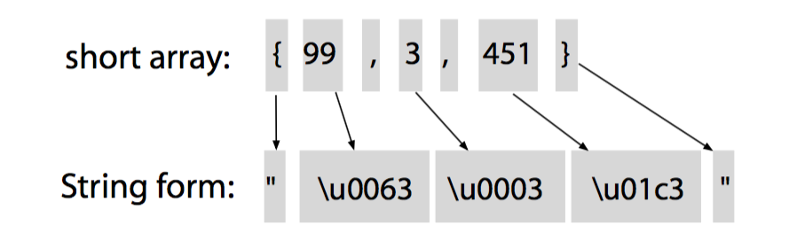

# 3.4 Building a Language Application

**识别** 到数组初始化语句后，下一步是 **转换** 初始化语句，将 `short` 值转换为对应的十六进制表示，例如将 `{99, 3, 451}` 转换为 `\u0063\u0003\u01c3`。

要转换 token，首先要从 parse tree 中提取 token，可以用默认的 parse-tree walker，当该 walker 执行深度优先遍历时，会触发一系列回调函数，我们只要继承 `XXXBaseListener` 并 override 特定方法即可。

先看几个手动转换的例子：



* 将 `{` 转换为 `"`
* 将 `}` 转换为 `"`
* 将 `short` 转换为 4 位十六进制表示的字符串，并前缀 `\u`

当 walker 进入、离开每个 phrase 时，都会在 `Listener` 中触发指定方法，可以在 `enterXXX` 方法中执行转换：

```Java
/**
 * 将 {1， 2， 3} 之类的 short 数组转换为 "\u0001\u0002\u0003`
 */
public class ShortToString extends ArrayInitBaseListener {

    // { -> "
    @Override
    public void enterInit(ArrayInitParser.InitContext ctx) {
        System.out.print('"');
    }

    // } -> "
    @Override
    public void exitInit(ArrayInitParser.InitContext ctx) {
        System.out.print('"');
    }

    @Override
    public void enterValue(ArrayInitParser.ValueContext ctx) {
        // Assumes no nested array initializers
        int value = Integer.valueOf(ctx.INT().getText());
        System.out.printf("\\u%04x", value); }
    }
```

* 不需要 override `BaseListener` 中的所有方法，按需覆盖；
* `ctx.INT()` 从上下文对象中获取 `INT` token 的值；

实现转换：

```Java
// 导入 ANTLR runtime
import org.antlr.v4.runtime.*;
import org.antlr.v4.runtime.tree.*;

public class Translate {
    public static void main(String[] args) throws Exception {
        // 从标准输入创建 CharStream
        ANTLRInputStream input = new ANTLRInputStream(System.in);

        // 创建 lexer，处理输入的 CharStream
        ArrayInitLexer lexer = new ArrayInitLexer(input);

        // 创建 buffer of tokens，存储 lexer 生成的 token
        CommonTokenStream tokens = new CommonTokenStream(lexer);

        // 创建 parser，处理 token 缓冲区中的 token
        ArrayInitParser parser = new ArrayInitParser(tokens);

        // 从 init rule，开始语法分析
        ParseTree tree = parser.init();

        /********************* Added ****************/
        // 创建 walker
        ParseTreeWalker walker = new ParseTreeWalker();

        // 遍历 parse tree，触发回调
        walker.walk(new ShortToString(), tree);

        System.out.println();
    }
}
```

* 相比 `Test.java`，只添加了最后 3 行！


